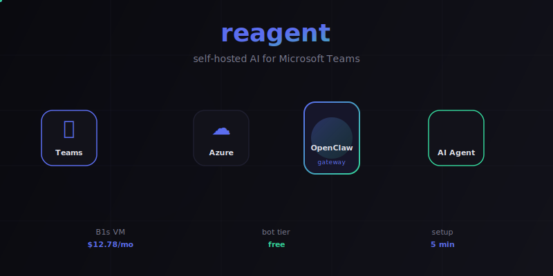

# reagent

<p align="center">
  
</p>

Self-hosted AI assistant for Microsoft Teams, powered by [OpenClaw](https://docs.openclaw.ai).

Deploys an OpenClaw gateway on an Azure B1s Linux VM (~$12.78/mo) with a Teams channel integration so you can chat with an AI agent directly in your Teams channels and DMs.

## Quick start

```bash
git clone https://github.com/nkuhn-vmw/reagent.git
cd reagent
cp .env.example .env   # fill in your Azure credentials
python main.py deploy   # push config to VM & restart
./scripts/package-teams-app.sh  # build Teams app zip
```

Then sideload `reagent-teams-app.zip` in Teams: **Apps > Manage your apps > Upload a custom app**.

## Setup guide

See the interactive setup guide at **[docs/index.html](docs/index.html)** or the [OpenClaw Teams docs](https://docs.openclaw.ai/channels/msteams).

## CLI

```bash
python main.py status   # check if gateway is running
python main.py deploy   # push config & restart
python main.py logs     # tail gateway logs
```

## Costs

~$12.78/mo for the Azure VM + static IP. Bot service is free. See [COSTS.md](COSTS.md).

## License

MIT
